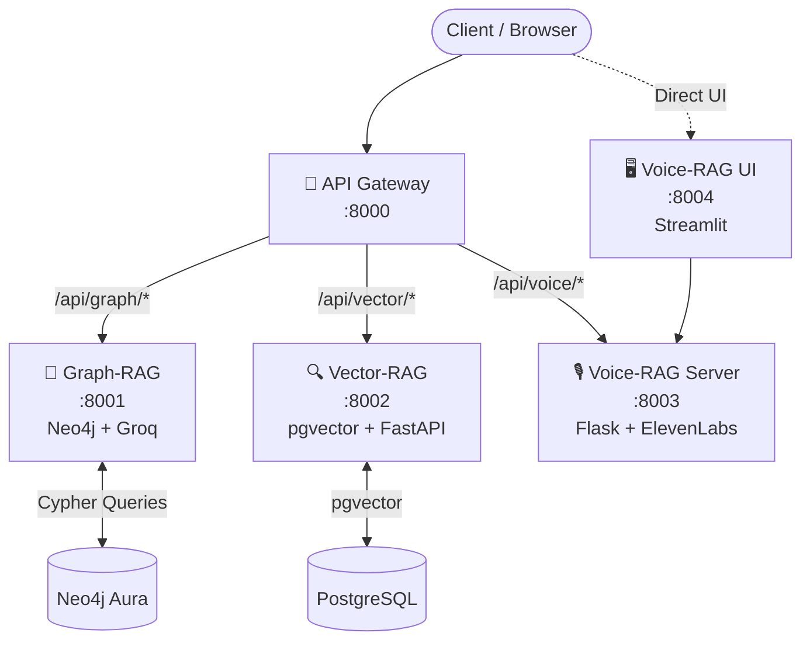

# RAG Orchestration System — Project Overview

## 🎯 Purpose

This project is a **production-ready, AI-powered RAG Orchestration Platform** — a single system that unifies three distinct Retrieval-Augmented Generation (RAG) architectures under one API Gateway, fully containerized for easy MVP deployment.

The end goal is to allow any client (frontend, mobile app, or third-party) to query a portfolio of AI services through one clean URL, with each service specialized for a different knowledge retrieval approach.

---

## 🏗️ Architecture



---

## 🧩 Microservices

| Service | Port | Stack | Purpose |
|---------|------|-------|---------|
| **API Gateway** | 8000 | FastAPI + httpx | Single entry point, routes to all services |
| **Graph-RAG** | 8001 | Neo4j + Groq Llama-3 | Strictly grounded portfolio Q&A — 0% hallucination |
| **Vector-RAG** | 8002 | pgvector + FastAPI | Semantic document search over PDFs/DOCX |
| **Voice-RAG Server** | 8003 | Flask + ElevenLabs | Multimodal: voice input → RAG → speech output |
| **Voice-RAG UI** | 8004 | Streamlit | Interactive voice chat interface |
| **PostgreSQL** | 5435 | pgvector:pg16 | Vector storage for Vector-RAG |

---

## 🌿 Git Branching Strategy

```
main                    ← Stable, production-ready release
│
├── service/graph-rag   ← Graph-RAG service code only
├── service/vector-rag  ← Vector-RAG service code only
├── service/voice-rag   ← Voice-RAG service code only
│
└── orchestration       ← Gateway + all services + docker-compose
                           (iterate here → PR → merge to main)
```

Each service branch is **independent** — it has its own `pyproject.toml`, `Dockerfile`, and `.env.example`. This allows individual services to be developed, tested, and deployed in isolation.

---

## 🚀 Quick Start

```bash
# 1. Clone the orchestration branch
git clone -b orchestration https://github.com/Monisha09-ds/RAG_Orchestration.git

# 2. Configure your environment
cp .env.template .env   # fill in your API keys

# 3. Launch the full stack
docker-compose up --build -d

# 4. Test
curl http://localhost:8000/health
```

---

## 🗺️ MVP Roadmap

- [x] Restructure code into independent microservices
- [x] Create unified API Gateway
- [x] Containerize all services with Docker Compose
- [x] Push individual service branches to GitHub
- [ ] Add authentication layer to the API Gateway
- [ ] Build a unified frontend (React/Next.js) to consume the Gateway
- [ ] Add CI/CD pipeline (GitHub Actions) for automated testing
- [ ] Deploy to cloud (AWS ECS / GCP Cloud Run)
- [ ] Merge `orchestration` → `main` for public MVP release
